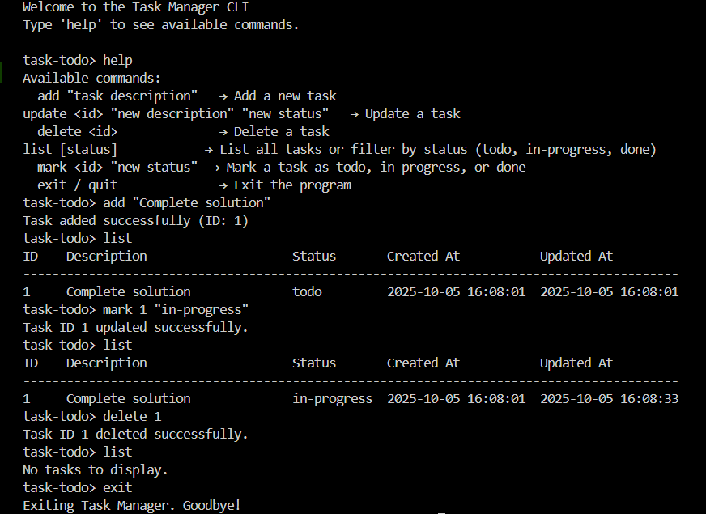

Task Tracker (Python CLI)

A simple command-line Task Tracker built in Python, inspired by the roadmap.sh project ideas
.

This project lets you add, update, delete, and mark tasks directly from the terminal. Tasks are stored in a JSON file for persistence, making it lightweight and easy to use.

✨ Features

➕ Add new tasks with descriptions

✏️ Update tasks (description, status, etc.)

✅ Mark tasks as completed or in-progress

❌ Delete tasks by ID

📂 Tasks saved in JSON for persistence

💻 Simple and intuitive CLI interface

```
python task.py
```

```
task-todo> add "Buy groceries"
task-todo> update 2 "Finish project" "in-progress"
task-todo> delete 3
task-todo> list

```
Demo
